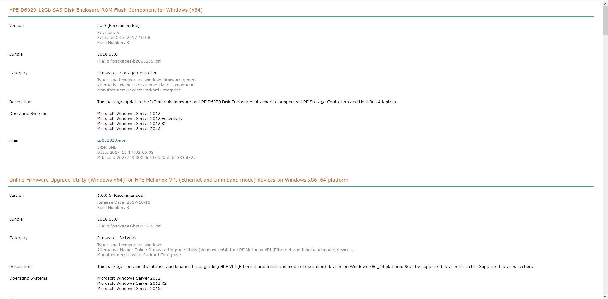

# SPPCmdlets

PowerShell module for querying HPE Service Pack for ProLiant (SPP) bundles

## Description

This is a basic PowerShell module for processing HPE Service Pack for ProLiant (SPP) contents.
It contains commands to parse manifest xml files in SPP folders to query, search, filter, and report on SPP bundles and components.

## Installation

Using the zip file:
- Download the SPPCmdlets.zip file to a temporary location
- Check the file properties and unblock it if blocked
- To install for the current user, extract the zip file to the user's PowerShell modules folder:
  "%USERPROFILE%\Documents\WindowsPowerShell\Modules\SPPCmdlets"
- To install for all users, extract the zip file to the system's PowerShell modules folder:
  "%PROGRAMFILES%\WindowsPowerShell\Modules\SPPCmdlets"

Using the powershell gallery:
- To install for the current user, start a PowerShell session and run:
  PS> Install-Module -Name SPPCmdlets -Scope CurrentUser
- To install for all users, start a PowerShell session, with admin privileges, and run:
  PS> Install-Module -Name SPPCmdlets -Scope AllUsers

## Usage

### Add bundles

Start by adding an SPP bundle using the command `Add-SPPBundle`. The command parses the XML files in the SPP manifest folder, which describe the SPP contents, and loads them into memory.

For example, to add the 2018-03 SPP image, assuming the image is mounted under G:\ drive:

```
PS> Add-SPPBundle G:\
```

The command `Get-SPPBundle` will get the SPP bundles that have been added:

```
PS> Get-SPPBundle

Version              Name                                     File                                     Tag
-------              ----                                     ----                                     ---
2018.03.0            Service Pack for ProLiant                g:\packages\bp003205.xml
```

The commands `ConvertTo-SPPBundleHtml` and `ConvertTo-SPPBundleCsv` convert the SPP bundle properties to HTML and CSV formats respectively. For example, to produce an HTML report, spp_2018_03.html, of the SPP bundle added above:

```
PS> Get-SPPBundle | ConvertTo-SPPBundleHtml spp_2018_03.html
```

For a detailed HTML report, add the `-Details` switch to the command `ConvertTo-SPPBundleHtml`.

### Search components

The command `Get-SPPComponent` will get SPP components from the bundles that have been added. Running it without parameters will retreive all components. To retrieve components with certain text in their names, use the `-Name` parameter (which is the default first parameter). The parameter accepts wildcards (it uses the PowerShell `-like` operator for matching).

For example, to retrieve components that have the words "lights out" in their names:

```
PS> Get-SPPComponent *lights*out*

Name                                                                             Version              Bundle
----                                                                             -------              ------
HP Lights-Out Online Configuration Utility for Linux (AMD64/EM64T)               5.2.0-0              2018.03.0
Online ROM Flash Component for Windows x64 - HPE Integrated Lights-Out 5         1.20                 2018.03.0
Online ROM Flash Component for Windows x64 - HPE Integrated Lights-Out 4         2.55                 2018.03.0
Online ROM Flash Component for Linux - HPE Integrated Lights-Out 4               2.55                 2018.03.0
Online ROM Flash Component for Linux - HPE Integrated Lights-Out 5               1.20                 2018.03.0
Online ROM Flash Component for VMware ESXi  - HPE Integrated Lights-Out 4        2.55                 2018.03.0
HP Lights-Out Online Configuration Utility for Windows x64 Editions              5.2.0.0              2018.03.0
```

The `-Name` parameter also accepts a comma-separated list of words (PowerShell array). For example, to retrieve components that also have the word "ilo" in their names, in addition to "lights out":

```
PS> Get-SPPComponent *lights*out*,*ilo*

Name                                                                             Version              Bundle
----                                                                             -------              ------
iLO 5 Automatic Server Recovery Driver for Windows Server 2016                   4.2.0.0              2018.03.0
Agentless Management Service (iLO 5) for SUSE Linux Enterprise Server 12         1.2.0                2018.03.0
iLO 5 Channel Interface Driver for Windows Server 2016                           4.1.0.0              2018.03.0
Online ROM Flash Component for VMware ESXi  - HPE Integrated Lights-Out 4        2.55                 2018.03.0
Online ROM Flash Component for Linux - HPE Integrated Lights-Out 5               1.20                 2018.03.0
Online ROM Flash Component for Windows x64 - HPE Integrated Lights-Out 4         2.55                 2018.03.0
iLO 3/4 Management Controller Driver Package for Windows Server 2008 to Serve... 3.30.0.0             2018.03.0
HP Lights-Out Online Configuration Utility for Windows x64 Editions              5.2.0.0              2018.03.0
Agentless Management Service (iLO 5) for SUSE Linux Enterprise Server 11         1.2.0                2018.03.0
iLO 3/4 Channel Interface Driver for Windows Server 2016                         3.30.0.0             2018.03.0
iLO 5 Automatic Server Recovery Driver for Windows Server 2012 R2                4.2.0.0              2018.03.0
iLO 3/4 Management Controller Driver Package for Windows Server 2016             3.30.0.0             2018.03.0
Agentless Management Service (iLO 5) for Red Hat Enterprise Linux 6 Server       1.2.0                2018.03.0
iLO 5 Channel Interface Driver for Windows Server 2012 R2                        4.1.0.0              2018.03.0
Online ROM Flash Component for Windows x64 - HPE Integrated Lights-Out 5         1.20                 2018.03.0
iLO 3/4 Channel Interface Driver for Windows Server 2008 to Server 2012 R2       3.30.0.0             2018.03.0
Online ROM Flash Component for Linux - HPE Integrated Lights-Out 4               2.55                 2018.03.0
HP Lights-Out Online Configuration Utility for Linux (AMD64/EM64T)               5.2.0-0              2018.03.0
Agentless Management Service (iLO 5) for Red Hat Enterprise Linux 7 Server       1.2.0                2018.03.0
```

### Filter components

The `Get-SPPComponent` command can filter retrieved components by passing it one or more filters. Filters are obtained from running any of the following commands. These commands accept a `-Name` parameter like above, which can be used to retrieve filters by matching against a word, or a list of words, in their names:

```
Get-SPPSystem
Get-SPPOperatingSystem
Get-SPPCategory
Get-SPPDevice
Get-SPPType
```

To see a list of all available system filters:

```
PS> Get-SPPSystem

Name
----
HPE ProLiant BL460c Gen10 Server
HPE ProLiant BL460c Gen9 Server
HPE ProLiant BL660c Gen9 Server
HPE ProLiant DL120 Gen9 Server
HPE ProLiant DL160 Gen9 Server
HPE ProLiant DL180 Gen9 Server
...
```

Or, to see a list of all available operating system filters:

```
PS> Get-SPPOperatingSystem

Name
----
Microsoft Windows Server 2012
Microsoft Windows Server 2012 Essentials
Microsoft Windows Server 2012 R2
Microsoft Windows Server 2016
Red Hat Enterprise Linux 6 Server (x86-64)
Red Hat Enterprise Linux 7 Server
SUSE LINUX Enterprise Server 11 (AMD64/EM64T)
SUSE Linux Enterprise Server 12
VMware vSphere 6.0
VMware vSphere 6.5
```

And the same for category filters:

```
PS> Get-SPPCategory

Name
----
Application - System Management
BIOS - System ROM
Driver - Chipset
Driver - Network
Driver - Security
Driver - Storage
Driver - Storage Controller
Driver - Storage Fibre Channel and Fibre Channel Over Ethernet
Driver - Storage Tape
Driver - System
Driver - System Management
Driver - Video
Firmware
Firmware - Blade Infrastructure
Firmware - Frame Infrastructure
Firmware - Lights-Out Management
...
```

Now, assume that we need to retrieve components for BL460c Gen10 servers, that support the Windows 2016 operating system, and are categorized as Firmware components. First retrieve the required system filter:

```
PS> $system = Get-SPPSystem *bl460*gen10*
PS> $system

Name
----
HPE ProLiant BL460c Gen10 Server
```

Then, the operating system filter:

```
PS> $os = Get-SPPOperatingSystem *windows*2016*
PS> $os

Name
----
Microsoft Windows Server 2016
```

And lastly, the category filters:

```
PS> $category = Get-SPPCategory *firmware*
PS> $category

Name
----
Firmware
Firmware - Blade Infrastructure
Firmware - Frame Infrastructure
Firmware - Lights-Out Management
Firmware - Network
Firmware - NVDIMM
Firmware - Power Management
Firmware - SAS Storage Disk
Firmware - SATA Storage Disk
Firmware - Storage Controller
Firmware - Storage Fibre Channel
Firmware - Storage Tape
Firmware - System
```

The retrieved filters can then be passed to the `Get-SPPComponent` command to retrieve SPP components that match these filters:

```
PS> $system,$os,$category | Get-SPPComponent

Name                                                                             Version              Bundle
----                                                                             -------              ------
HPE D6020 12Gb SAS Disk Enclosure ROM Flash Component for Windows (x64)          2.53                 2018.03.0
Online Firmware Upgrade Utility (Windows x64) for HPE Mellanox VPI (Ethernet ... 1.0.0.6              2018.03.0
HPE QLogic NX2 Online Firmware Upgrade Utility for Windows Server x64 Editions   5.1.2.2              2018.03.0
HPE Broadcom NetXtreme-E Online Firmware Upgrade Utility for Windows Server x... 5.1.2.2              2018.03.0
Online ROM Flash Component for Windows (x64) - HPE Smart Array P408i-p, P408e... 1.34                 2018.03.0
Online ROM Flash for Windows x64 - Advanced Power Capping Microcontroller Fir... 1.0.4                2018.03.0
HPE Firmware Flash for Emulex Fibre Channel Host Bus Adapters for Windows 201... 2018.02.01           2018.03.0
HPE Firmware Flash for 16GB NVDIMM-N DDR4-2666 - Windows x64 Editions            1.04                 2018.03.0
Online Flash Component for Windows x64 - Gen10 NVMe Backplane PIC Firmware       1.20                 2018.03.0
HPE Firmware Online Flash for QLogic Fibre Channel Host Bus Adapters - Window... 2018.02.01           2018.03.0
HPE Firmware Flash for Emulex Converged Network Adapters for Windows (x64)       2018.02.01           2018.03.0
HPE Intel Online Firmware Upgrade Utility for Windows Server x64 Editions        5.1.2.2              2018.03.0
Online HPE BladeSystem c-Class Onboard Administrator Firmware Component for W... 4.80                 2018.03.0
HPE D3600/D3700/D3610/D3710 12Gb SAS Disk Enclosure ROM Flash Component for W... 4.04                 2018.03.0
HPE Broadcom NX1 Online Firmware Upgrade Utility for Windows Server x64 Editions 5.1.2.2              2018.03.0
Online ROM Flash Component for Windows x64 - HPE Integrated Lights-Out 5         1.20                 2018.03.0
HPE QLogic FastLinQ Online Firmware Upgrade Utility for Windows Server x64 Ed... 5.1.2.2              2018.03.0
```

The commands `ConvertTo-SPPComponentHtml` and `ConvertTo-SPPComponentCsv` convert SPP component properties to HTML and CSV formats respectively.

For example, to produce an HTML report, bl460_win_firmware.html, of the components from the above example:

```
PS> $system,$os,$category | Get-SPPComponent | ConvertTo-SPPComponentHtml bl460_win_firmware.html
```



For a detailed HTML report, add the `-Details` switch to the command `ConvertTo-SPPComponentHtml`. This produces a longer report that includes component notes and revision history.

### Compare versions

The command `Get-SPPComponent` has a `-Versions` switch which allows for comparing versions across bundles. It can limit the components retrieved to those that have either Changed or Unchanged versions.

Assume we added another SPP image. For example the 2018-06 SPP image, assuming the image is mounted under H:\ drive:

```
PS> Add-SPPBundle H:\
PS> Get-SPPBundle

Version              Name                                     File                                     Tag
-------              ----                                     ----                                     ---
2018.06.0            Service Pack for ProLiant                h:\packages\bp003135.xml
2018.03.0            Service Pack for ProLiant                g:\packages\bp003205.xml
```

Now, the command below will retrieves SPP components containing the words "lights out" in their names, from both SPP bundles:

```
PS> Get-SPPComponent *lights*out*

Name                                                                             Version              Bundle
----                                                                             -------              ------
HP Lights-Out Online Configuration Utility for Linux (AMD64/EM64T)               5.2.0-0              2018.03.0
HP Lights-Out Online Configuration Utility for Linux (AMD64/EM64T)               5.3.0-0              2018.06.0
Online ROM Flash Component for Windows x64 - HPE Integrated Lights-Out 5         1.20                 2018.03.0
Online ROM Flash Component for Windows x64 - HPE Integrated Lights-Out 5         1.30                 2018.06.0
Online ROM Flash Component for Windows x64 - HPE Integrated Lights-Out 4         2.55                 2018.03.0
Online ROM Flash Component for Windows x64 - HPE Integrated Lights-Out 4         2.60                 2018.06.0
Online ROM Flash Component for Linux - HPE Integrated Lights-Out 4               2.55                 2018.03.0
Online ROM Flash Component for Linux - HPE Integrated Lights-Out 4               2.60                 2018.06.0
Online ROM Flash Component for Linux - HPE Integrated Lights-Out 5               1.20                 2018.03.0
Online ROM Flash Component for Linux - HPE Integrated Lights-Out 5               1.30                 2018.06.0
Online ROM Flash Component for VMware ESXi  - HPE Integrated Lights-Out 4        2.55                 2018.03.0
Online ROM Flash Component for VMware ESXi  - HPE Integrated Lights-Out 4        2.60                 2018.06.0
HP Lights-Out Online Configuration Utility for Windows x64 Editions              5.2.0.0              2018.03.0
HP Lights-Out Online Configuration Utility for Windows x64 Editions              5.2.0.0              2018.06.0
```

To only retrieve those components that changed versions between the two SPP bundle releases:

```
PS> Get-SPPComponent *lights*out* -Versions Changed

Name                                                                             Version              Bundle
----                                                                             -------              ------
Online ROM Flash Component for Windows x64 - HPE Integrated Lights-Out 5         1.30                 2018.06.0
Online ROM Flash Component for Windows x64 - HPE Integrated Lights-Out 5         1.20                 2018.03.0
Online ROM Flash Component for Windows x64 - HPE Integrated Lights-Out 4         2.60                 2018.06.0
Online ROM Flash Component for Windows x64 - HPE Integrated Lights-Out 4         2.55                 2018.03.0
Online ROM Flash Component for VMware ESXi  - HPE Integrated Lights-Out 4        2.60                 2018.06.0
Online ROM Flash Component for VMware ESXi  - HPE Integrated Lights-Out 4        2.55                 2018.03.0
Online ROM Flash Component for Linux - HPE Integrated Lights-Out 5               1.30                 2018.06.0
Online ROM Flash Component for Linux - HPE Integrated Lights-Out 5               1.20                 2018.03.0
Online ROM Flash Component for Linux - HPE Integrated Lights-Out 4               2.60                 2018.06.0
Online ROM Flash Component for Linux - HPE Integrated Lights-Out 4               2.55                 2018.03.0
HP Lights-Out Online Configuration Utility for Linux (AMD64/EM64T)               5.3.0-0              2018.06.0
HP Lights-Out Online Configuration Utility for Linux (AMD64/EM64T)               5.2.0-0              2018.03.0
```

Likewise, to retrieve components that did not change versions between the two releases:

```
PS> Get-SPPComponent *lights*out* -Versions Unchanged

Name                                                                             Version              Bundle
----                                                                             -------              ------
HP Lights-Out Online Configuration Utility for Windows x64 Editions              5.2.0.0              2018.06.0
HP Lights-Out Online Configuration Utility for Windows x64 Editions              5.2.0.0              2018.03.0
```

Finally, the command `ConvertTo-SPPComponentHtml` has a `-Combine` switch. When specified, the generated HTML report will combine all versions of a component under one heading, instead of lising each version separately.

### Copy components

The `Copy-SPPComponent` command can be used to copy component files to a specified folder.

For example, to copy the component files from the above example to an empty folder called `Components`, which was created under the C:\ drive:

```
PS> Get-SPPComponent *lights*out* | Copy-SPPComponent "C:\Components"
```
